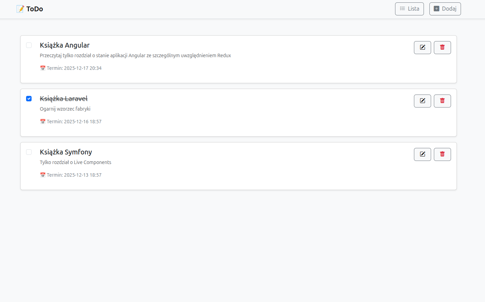

# 📝 ToDo App – Symfony 7 + Docker + Bootstrap



Projekt demonstracyjny aplikacji ToDo zbudowany w oparciu o **Symfony 7**

- **Docker Compose**
- **Nginx stable-alpine reverse proxy** 
- **PHP-FPM 8.4 runtime execution engine**
- **MySQL**
- **Webpack Encore**
- **Bootstrap UI framework**
- **Bootstrap Icons**

---

## 🚀 Uruchomienie projektu

### 1. Budowa i uruchomienie kontenerów
```bash
docker compose up -d --build
```

### 2. Frontend (Webpack Encore)
```bash
# Kompilacja jednorazowa
npm run dev

# Tryb obserwacji (watch)
npm run watch

# Budowa produkcyjna
npm run build
```

### 3. Migracje bazy danych
```bash
docker compose exec php sh

bin/console doctrine:migrations:migrate

bin/console make:migration
```

### 4. Dostęp do bazy MySQL
Z poziomu hosta możesz połączyć się z bazą danych (np. przez MySQL Workbench lub DBeaver) używając poniższych danych:
- **Host**: 127.0.0.1
- **Port**: 33061
- **User**: symfony
- **Password**: !changeMe!
- **Database**: todo_app
